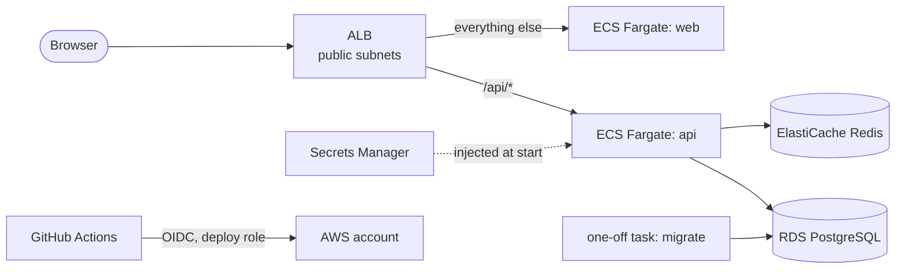

# nest-next-aws-terraform

[](https://github.com/sotream/nest-next-aws-terraform/actions/workflows/ci.yml)

Terraform that deploys [nest-next-starter](https://github.com/sotream/nest-next-starter) (a NestJS API, a
Next.js web app, PostgreSQL and Redis) to AWS on ECS Fargate, in three environments, with CI/CD through GitHub
OIDC and no secret values in Terraform state. The application is deployed unmodified; this repository is only
the infrastructure around it.

It is a portfolio project that shows how I structure Infrastructure-as-Code: small single-purpose modules,
one composition module, thin environment roots, ephemeral and write-only secrets, least-privilege IAM, a
documented cost model, and an honest list of what was not verified. **Nothing here has been applied to an AWS
account**; read [Known limitations](#known-limitations) before you use it.

## What's included

| Area          | Choice                                                                                         |
| ------------- | ---------------------------------------------------------------------------------------------- |
| Compute       | ECS Fargate: `api` and `web` as separate services behind one ALB, `/api/*` routed to the API   |
| Data          | RDS PostgreSQL (private, KMS-encrypted, backups) and ElastiCache Redis (TLS and AUTH)          |
| Network       | VPC, 2 AZs, public and private subnets, configurable NAT, S3 gateway endpoint                  |
| Secrets       | Ephemeral passwords written with write-only attributes to RDS, ElastiCache and Secrets Manager |
| Edge          | ALB with optional ACM certificate and Route 53 alias when a domain is set                      |
| Migrations    | One-off ECS task that must succeed before the services roll                                    |
| Observability | CloudWatch log groups, SNS topic, alarms for 5xx, CPU, memory, task count and RDS              |
| State         | S3 with native locking, one bucket and one key per environment                                 |
| CI/CD         | GitHub Actions: fmt, validate, tflint, checkov, plan comments, OIDC deploy with no stored keys |
| Docs          | Architecture, 8 ADRs, runbook, troubleshooting, cost estimate, generated module reference      |

## Prerequisites

- Terraform 1.11 or later (write-only secret attributes need it), `tflint`
- For the quality gate: nothing else. For a real deployment: an AWS account, the AWS CLI, a GitHub
  repository and, for `stage` and `prod`, a Route 53 hosted zone

## Quick start

Check the repository without any AWS access:

```bash
./scripts/check.sh      # fmt, validate, tflint and 74 offline terraform test runs
```

Plan an environment against your own account (see [Getting started](docs/guides/getting-started.md) for the
bootstrap that creates the state bucket first):

```bash
cd envs/dev
cp terraform.tfvars.example terraform.tfvars        # placeholders only; real tfvars are git-ignored
terraform init -backend-config="bucket=<state bucket>" -backend-config="region=<region>"
terraform plan -var "permissions_boundary_arn=<arn from bootstrap>"
```

Deploying is done by the **Deploy** workflow, which builds the images from a pinned commit of the starter.

## Architecture



How it works in one paragraph: one ALB sends `/api/*` to the API and everything else to the web app, so both
share one origin and satisfy the starter's same-site cookie rule. Tasks run in private subnets and reach the
database and cache through security-group rules that name the task groups. Terraform generates the
passwords in memory and writes them straight to RDS, ElastiCache and Secrets Manager, so they never enter
state. A deployment applies the infrastructure, builds the images, runs the migration as a one-off task,
and only then rolls the services, with automatic rollback on an unhealthy rollout. More in the
[architecture overview](docs/architecture/overview.md) and the [security model](docs/architecture/security-model.md).

## Environments

|                          | dev                        | stage                  | prod                                       |
| ------------------------ | -------------------------- | ---------------------- | ------------------------------------------ |
| Domain                   | optional (HTTP without it) | required               | required                                   |
| NAT gateways             | 1                          | 1                      | one per AZ                                 |
| Tasks per service        | 1                          | 1                      | 2                                          |
| RDS                      | `t4g.micro`, single-AZ     | `t4g.micro`, single-AZ | `t4g.small`, Multi-AZ, deletion protection |
| Estimated cost per month | about 120 USD              | about 145 USD          | about 315 USD                              |

All three are the same `modules/app-stack` called from a thin root; they differ only in variables. Details
and the rule for the domain are in [Environments](docs/guides/environments.md); the cost assumptions are in
the [cost estimate](docs/guides/cost-estimate.md).

## Project structure

```
bootstrap/    state bucket, GitHub OIDC provider, CI roles and permissions boundary (applied once by hand)
modules/      network, ecr, alb, ecs-service, rds-postgres, elasticache-redis, secrets, iam,
              observability-basics, and app-stack (the only composition)
envs/         dev, stage, prod: one module call each, plus backend and provider
docs/         architecture, ADRs, guides, module reference
scripts/      check.sh (quality gate) and docs.sh (module README tables)
.github/      workflows (ci, plan, deploy), a composite action and Dependabot
.claude/      rules for Claude Code
```

## Documentation

- [Architecture overview](docs/architecture/overview.md) and [security model](docs/architecture/security-model.md)
- [Module reference](docs/reference/modules.md)
- Decisions (ADR):
  - [0001 ECS Fargate over EKS, App Runner and EC2](docs/adr/0001-ecs-fargate.md)
  - [0002 Network layout and the NAT cost trade-off](docs/adr/0002-network-and-nat.md)
  - [0003 Secrets handling](docs/adr/0003-secrets-handling.md)
  - [0004 Terraform state and environment layout](docs/adr/0004-state-and-environments.md)
  - [0005 Migrations as a one-off ECS task](docs/adr/0005-migrations-one-off-task.md)
  - [0006 Trust proxy behind the ALB](docs/adr/0006-trust-proxy-behind-alb.md)
  - [0007 Kafka on AWS](docs/adr/0007-kafka-on-aws.md)
  - [0008 Database TLS](docs/adr/0008-database-tls.md)
- Guides:
  - [Getting started](docs/guides/getting-started.md)
  - [Environments](docs/guides/environments.md)
  - [CI/CD](docs/guides/ci-cd.md)
  - [Operations runbook](docs/guides/operations.md)
  - [Testing](docs/guides/testing.md)
  - [Troubleshooting](docs/guides/troubleshooting.md)
  - [Cost estimate](docs/guides/cost-estimate.md)

## CI/CD

- `ci.yml` (every push and pull request, no AWS access): `terraform fmt -check`, `validate`, `tflint`,
  offline `terraform test`, checkov, Prettier, generated-docs check and a gitleaks scan.
- `plan.yml` (pull requests): `terraform plan` for the three environments through a read-only OIDC role,
  posted as one updated comment per environment.
- `deploy.yml` (manual): OIDC role per environment, builds the images from a pinned starter commit, pushes to
  ECR, runs the migration task, then updates the services and smoke-tests them.

Every checkov skip is an inline comment with its reason (37 at the time of writing). See the
[CI/CD guide](docs/guides/ci-cd.md).

## Deployment

The starter does not choose a platform; this repository does. Read the starter's
[deployment guide](https://github.com/sotream/nest-next-starter/blob/main/docs/guides/deployment.md) and
[ADR 0007](https://github.com/sotream/nest-next-starter/blob/main/docs/adr/0007-no-trust-proxy.md): behind an
ALB the API cannot tell clients apart, so rate limits are shared ([ADR 0006](docs/adr/0006-trust-proxy-behind-alb.md)).
The starter has no release tags, so deployments pin a full commit SHA.

## About this project

A personal portfolio repository, shared as is. It comes with no warranty and no support, and I make no promise
to review issues or pull requests, answer questions or keep it up to date. Use it, fork it and change it
freely under the [MIT license](LICENSE); check it against your own security and compliance needs before you
run it for real.

Built with Claude Code. I made the design decisions and reviewed the result; the reasoning is in the
[ADRs](docs/adr).

## Known limitations

What was **not** verified. Everything below was developed without an AWS account.

- **Nothing was applied.** No resource was created. IAM policies, trust conditions, the write-only secret
  flow (RDS, ElastiCache and Secrets Manager together), the ALB rules, the task definitions and the migration
  task have never run against real AWS.
- **`terraform plan` was not run.** It needs credentials and real data sources. The checks are `fmt`,
  `validate`, `tflint` and 74 offline `terraform test` runs against a mocked provider, plus checkov. Mocked
  plans cannot show that AWS accepts an argument, and some assertions (for example that the migration task
  definition exists) are covered at module level only.
- **The workflows were never run.** `actionlint` checks their syntax. The per-environment variable lookup
  (`vars[format(...)]`) and the OIDC trust conditions are untested.
- **The starter on Fargate is untested.** The images were not built or run. The starter has no release tags,
  so a commit SHA is pinned. The web image inlines the public origin at build time.
- **Database TLS is `sslmode=no-verify`**: encrypted, but the server certificate is not checked. The design
  comes from reading the TypeORM and `pg` source, not from a real RDS connection
  ([ADR 0008](docs/adr/0008-database-tls.md)).
- **Shared rate limits behind the ALB** until the starter supports a `TRUST_PROXY` setting
  ([ADR 0006](docs/adr/0006-trust-proxy-behind-alb.md)). Sign-in can lock everyone out under load.
- **The deploy role is broad** within the services it manages, and all three environments share one account.
- **Pull request plans do not refresh** (`-refresh=false`), because the plan role cannot read secret values,
  so they show configuration changes, not drift.
- **Deploy roles are not tied to `main` by IAM**: the GitHub Environments must restrict deployment branches
  (documented, not enforceable from Terraform), and the three roles can affect each other's resources in the
  shared account.
- **The API health check** uses `/api/health/live` by default, so the load balancer keeps routing to tasks
  while the database or Redis is down (requests then fail in the app). `/api/health/ready` takes unready tasks
  out of rotation but can make ECS restart every API task during an outage (`api_health_path` switches it).
- **Rotating credentials needs a restart** (`force_restart` on the deploy workflow); no automatic rotation.
- **Cost figures are estimates** from public on-demand prices, not billing data or a live price lookup.
- **Security scanning:** checkov 3.3.26 was run locally with no failed checks and 37 skips, each with a
  reason. Trivy was not used. `tflint` runs with the AWS ruleset 0.40.0. Dependabot and gitleaks only run on
  GitHub.
- **Kafka is not deployed** ([ADR 0007](docs/adr/0007-kafka-on-aws.md)).
- **Diagrams** were rendered with mermaid-cli, not checked on GitHub.

## Contributing

Pull requests and issues are welcome but may go unanswered (see [About this project](#about-this-project)).
For anything bigger than a small fix, fork the repository instead. Commits follow
[Conventional Commits](https://www.conventionalcommits.org): `feat(alb): add HTTPS listener`,
`fix(rds): require TLS and request it in DATABASE_URL`. Before opening a pull request run
`./scripts/check.sh` and `./scripts/docs.sh`. Details in [CONTRIBUTING.md](CONTRIBUTING.md).

To report a vulnerability, see [SECURITY.md](SECURITY.md).

## License

[MIT](LICENSE)
