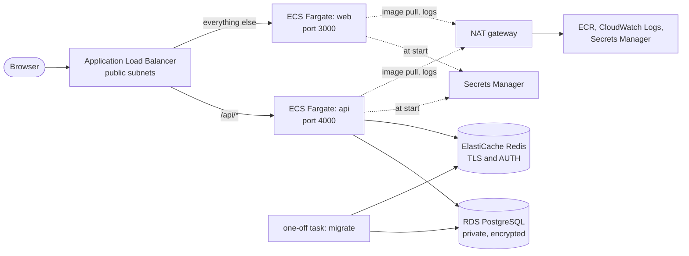
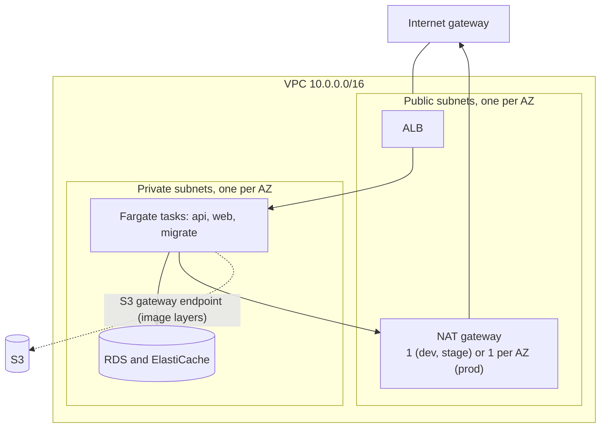
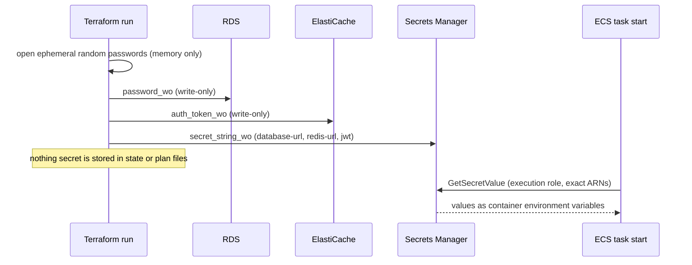
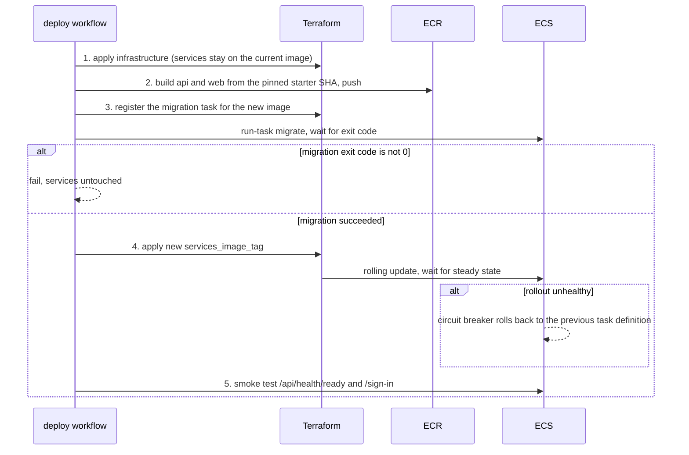
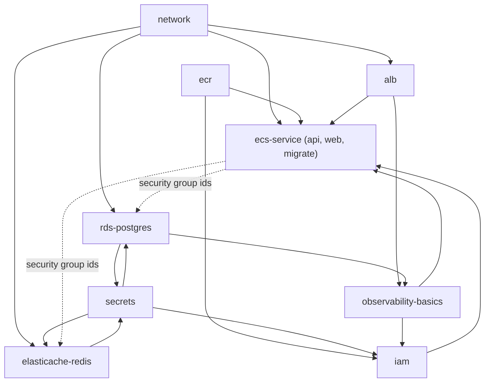

# Architecture overview

## What this is, and what it is not

This repository deploys the unmodified [nest-next-starter](https://github.com/sotream/nest-next-starter)
(NestJS API, Next.js web app, PostgreSQL, Redis) to AWS with Terraform, in three environments: `dev`, `stage`
and `prod`.

It is a portfolio-grade reference, not a production platform. Nothing here has been applied to a real AWS
account; see [Known limitations](../../README.md#known-limitations). Kafka, which the starter treats as
optional, is not deployed ([ADR 0007](../adr/0007-kafka-on-aws.md)).

## Components

| Component         | Role                                                                     | Why it is there                                                                               |
| ----------------- | ------------------------------------------------------------------------ | --------------------------------------------------------------------------------------------- |
| ALB               | Public entry point, TLS termination (when a domain is set), path routing | One host for web and API satisfies the starter's same-site cookie rule                        |
| `api` service     | NestJS API on Fargate, private subnets                                   | Stateless; scaled by task count                                                               |
| `web` service     | Next.js standalone server on Fargate, private subnets                    | Serves pages; calls the API on the same origin                                                |
| `migrate` task    | One-off Fargate task from the API image                                  | Runs TypeORM migrations before a rollout ([ADR 0005](../adr/0005-migrations-one-off-task.md)) |
| RDS PostgreSQL    | Application data                                                         | Managed backups, encryption, optional Multi-AZ                                                |
| ElastiCache Redis | Rate-limit counters and health check                                     | The starter uses Redis for rate limiting only                                                 |
| Secrets Manager   | Database URL, Redis URL, JWT secret                                      | Injected into containers at start ([ADR 0003](../adr/0003-secrets-handling.md))               |
| ECR               | Image repositories (`api`, `web`)                                        | Immutable tags, scan on push                                                                  |
| CloudWatch        | Log groups, SNS topic, alarms                                            | Basics only ([observability module](../reference/modules.md))                                 |
| NAT gateway       | Egress for private tasks                                                 | See [ADR 0002](../adr/0002-network-and-nat.md)                                                |

## Request flow

1. The browser opens the public origin. With a domain this is `https://<domain>`; the ALB terminates TLS
   with an ACM certificate and port 80 redirects to 443. Without a domain (dev only) it is
   `http://<alb dns name>`.
2. The listener rule sends `/api/*` to the `api` target group and everything else to the `web` target group.
3. Targets are Fargate task IPs. The API target group checks `/api/health/live` (no dependencies, see below); the
   web target group checks `/sign-in`.
4. The API talks to RDS on 5432 and Redis on 6379 over TLS (`rediss://`, and `sslmode=no-verify` for
   PostgreSQL, see [ADR 0008](../adr/0008-database-tls.md)).

The API container's own health check and, by default, the target group both use `/api/health/live`, which does
not touch dependencies. That keeps a database or Redis outage from turning into a restart loop: ECS also
replaces tasks that the load balancer reports unhealthy, so with `api_health_path = "/api/health/ready"` an
outage makes ECS stop and restart every API task, which the starter's `live`/`ready` split is meant to avoid.
The trade-off of `live` is that the load balancer keeps routing to tasks whose dependencies are down, so
requests fail inside the app instead of being taken out of rotation. If every target is unhealthy the ALB routes to all of them anyway (fail-open). The starter's rate
limiting also fails open ([starter ADR 0008](https://github.com/sotream/nest-next-starter/blob/main/docs/adr/0008-throttler-redis-fail-open.md)).

## Network layout

Two availability zones are used. Security groups express access; each rule below is the only way in.

| Source                | Destination        | Port    | Why                                          |
| --------------------- | ------------------ | ------- | -------------------------------------------- |
| Internet              | ALB                | 80, 443 | Public entry (443 only when a domain is set) |
| ALB                   | api tasks          | 4000    | Routed API traffic                           |
| ALB                   | web tasks          | 3000    | Routed web traffic                           |
| api and migrate tasks | RDS                | 5432    | Database access                              |
| api and migrate tasks | ElastiCache        | 6379    | Redis access                                 |
| Tasks                 | Internet (via NAT) | any     | ECR, Secrets Manager, CloudWatch Logs        |

The ALB may only send traffic inside the VPC CIDR. The default security group has no rules.

## Secrets flow

Write-only attributes are sent only when their version changes. `credentials_version` raises the version of
the database password and the Redis token together; the URL secrets add a hash of the host so a replaced
database or cache rewrites its URL in the same apply. See [ADR 0003](../adr/0003-secrets-handling.md) and
[operations: rotating credentials](../guides/operations.md).

## Deployment flow

The workflow assumes an AWS role through GitHub OIDC; no AWS keys are stored in GitHub. Details:
[CI/CD guide](../guides/ci-cd.md).

## Environment model

`modules/app-stack` composes every module. Each `envs/<name>/` root is one `module "app"` call plus a
backend key and a provider; the environment's sizing comes from variable defaults.

| Setting           | dev                                     | stage                    | prod                                                        |
| ----------------- | --------------------------------------- | ------------------------ | ----------------------------------------------------------- |
| `APP_ENV`         | `dev` without a domain, `prod` with one | `prod` (domain required) | `prod` (domain required)                                    |
| NAT gateways      | 1                                       | 1                        | one per AZ                                                  |
| Tasks per service | 1 (0.25 vCPU, 0.5 GB)                   | 1 (0.5 vCPU, 1 GB)       | 2 (0.5 vCPU, 1 GB)                                          |
| RDS               | `db.t4g.micro`, single-AZ, 7 d backups  | same as dev              | `db.t4g.small`, Multi-AZ, 14 d backups, deletion protection |
| Redis             | `cache.t4g.micro`, 1 node               | same as dev              | `cache.t4g.small`, primary and replica                      |
| Log retention     | 14 d                                    | 30 d                     | 90 d                                                        |

## Module dependency graph

`secrets` and `rds-postgres`/`elasticache-redis` reference each other, but at different resources: the secrets
module opens the ephemeral passwords that the database and cache consume, and consumes their addresses to
write the URL secrets. Terraform resolves this at resource level, so there is no cycle.

## Design decisions

- [0001 ECS Fargate over EKS, App Runner and EC2](../adr/0001-ecs-fargate.md)
- [0002 Network layout and the NAT cost trade-off](../adr/0002-network-and-nat.md)
- [0003 Secrets handling](../adr/0003-secrets-handling.md)
- [0004 Terraform state and environment layout](../adr/0004-state-and-environments.md)
- [0005 Migrations as a one-off ECS task](../adr/0005-migrations-one-off-task.md)
- [0006 Trust proxy behind the ALB](../adr/0006-trust-proxy-behind-alb.md)
- [0007 Kafka on AWS](../adr/0007-kafka-on-aws.md)
- [0008 Database TLS](../adr/0008-database-tls.md)
